# Tổng quan  
Tài liệu này đề ra lộ trình 10 giờ làm việc tại công ty để xây dựng **pipeline OCR baseline** dùng LM Studio với mô hình `Qwen3-VL-8B-Instruct (GGUF Q4_K_M)`. Nội dung bao gồm: (1) Thiết lập môi trường LM Studio và tải model Qwen, (2) Phân đoạn trang thành hàng (rows) và cắt trường (fields) với `FormTemplate`, (3) Gọi Qwen để đọc chữ trong các trường, (4) Xử lý và xuất kết quả ra JSON/CSV/Excel, (5) Tích hợp xuất dữ liệu vào Telegram và n8n, (6) Kiểm thử và đo đạc hiệu năng. Mỗi bước có nhiệm vụ rõ ràng, thời gian ước tính, và tiêu chí chấp nhận.  

## Giả thiết & môi trường  
- **Đường dẫn dự án:** `D:\production_ocr` (tương tự máy nhà).  
- **Mô hình:** Qwen3-VL-8B-Instruct (đã load sẵn file GGUF Q4_K_M) trên **LM Studio** local server.  
- **Phần cứng:** GPU NVIDIA RTX 3050 (6GB), 32GB RAM, CPU Intel i7-14700K.  
- **Dữ liệu sẵn có:** PDF, ảnh PNG/JPG của các form cần OCR. Có thể dùng `pdf_processor` để chuyển PDF→ảnh.  
- **Công cụ/libraries:** Python ≥3.9, `lmstudio` SDK hoặc `openai` SDK, `opencv-python`, `numpy`, `Pillow`, `pandas`, `python-telegram-bot` (hoặc `requests`)… Cài đặt ví dụ:  
  ```bash
  pip install lmstudio openai opencv-python-headless numpy pillow pandas
  ```  
  (câu lệnh lấy từ tài liệu LM Studio). Nếu máy offline, chuẩn bị sẵn cài đặt (hoặc copy gói `.whl`).  
- **LM Studio:** Chạy LM Studio ở chế độ server trên cổng 1234 (chỉnh từ tab Developer hoặc dùng lệnh CLI: `lms server start`). Tiếp theo, đăng nhập trong Python và tải model Qwen:  
  ```python
  import lmstudio as lms
  with lms.Client(api_key="lm-studio") as client:   # lấy token hoặc dùng "lm-studio"
      model = client.llm.model("hf://Qwen/Qwen3-VL-8B-Instruct")
      model.load()
  ```  
  hoặc dùng `openai` SDK:  
  ```python
  from openai import OpenAI
  client = OpenAI(base_url="http://localhost:1234/v1", api_key="lm-studio")
  response = client.chat.completions.create(
      model="Qwen/Qwen3-VL-8B-Instruct",
      messages=[{"role":"user","content":"Hello"}]
  )
  ```  
  (ví dụ trên cho thấy cách dùng OpenAI SDK với LM Studio). Cần đảm bảo **model identifier** đúng (theo danh sách trong LM Studio sau khi tải model).  

## Lộ trình công việc chi tiết  
Dưới đây chia ngày làm 10 giờ (08:00–18:00) thành các bước lớn. *Giả sử sáng 08:00–12:00 dành cho nhập liệu (GT), buổi chiều thực hiện công việc kế hoạch dưới đây. Nếu việc GT kéo dài, ưu tiên hoàn thành các bước ban đầu trước, hoãn tích hợp/benchmark về sau.*

- **08:00–12:00:** Nhập liệu GT (đã có kế hoạch riêng).  
- **13:00–13:30:** *Thiết lập môi trường.* Chạy LM Studio server, tải model. Cài đặt các thư viện (pip như trên). Test chạy một câu lệnh chat đơn giản qua API để kiểm tra kết nối (nếu được, câu trả lời từ Qwen phản hồi đúng, ví dụ “Hello” trả về “Xin chào” chẳng hạn). **Tiêu chí Pass:** LM Studio server chạy ổn định, model Qwen3-VL-8B-Instruct đã load, lệnh chat đầu tiên thành công. (Tham khảo tài liệu.)

- **13:30–14:30:** *Xây dựng module phân đoạn (P6.3).* Tận dụng lớp `FormTemplate` đã có (trong `app/form_template.py`) để cắt ảnh trang đã align thành 20 ảnh hàng. Ví dụ:  
  ```python
  from app.form_template import FormTemplate
  import cv2
  page = cv2.imread("aligned_page001.png", cv2.IMREAD_COLOR)
  template = FormTemplate("T1")     # T1 là loại form đang dùng
  rows = template.row_crop(page)    # list 20 ảnh hàng
  for r in rows:
      assert r.shape[0] > 0
  ```  
  Sau đó dùng `template.field_crop(row_img)` để cắt mỗi ảnh hàng ra 14 ảnh trường (STT, Ngày, etc). Kiểm tra sơ bộ: trên một trang mẫu, hiển thị hình 20 hàng và 14 trường để xác nhận khớp. Tạo file `app/segmentation.py` chứa hàm `segment_page(image_path, template)` trả về danh sách hàng kèm ảnh và bbox, và file `tests/test_segmentation.py` để kiểm thử tự động trên trang mẫu (ví dụ `1207_T1_p003`). **Tiêu chí Pass:** Ảnh đầu ra có đúng 20 hàng và mỗi hàng 14 trường; vị trí ô cắt khớp với form (kiểm tra bằng mắt hoặc mã).

- **14:30–15:00:** *Chạy thử phân đoạn.* Thử đoạn mã trên một trang. Ví dụ:  
  ```bash
  python tests/test_segmentation.py
  ```  
  Đảm bảo không có lệch dòng: mỗi row chỉ chứa thông tin của row tương ứng. Sửa lại tham số nếu cần (ví dụ do alignment chưa chính xác). Nếu gặp khó khăn, tạm thời có thể tăng margin/hạ threshold mask để đảm bảo cắt đúng. **Tiêu chí Pass:** Đầu ra test không báo lỗi, hình các hàng/trường hiển thị chính xác.

- **15:00–15:30:** *Gọi Qwen thử nghiệm (P6.4).* Viết hàm để gọi API LM Studio cho từng hàng (hoặc từng trường). Ví dụ với OpenAI SDK:  
  ```python
  from openai import OpenAI
  client = OpenAI(base_url="http://localhost:1234/v1", api_key="lm-studio")
  ```
  Tạo prompt mẫu để Qwen đọc nội dung từng hàng gồm 14 trường. Có thể theo dạng chat với system role:  
  ```
  System: "Bạn là một hệ thống OCR, nhiệm vụ là đọc các trường thông tin sau từ ảnh: stt, date, order_code, drawing_code, revision, work_code, target_time, start_time, end_time, processed_qty, good_qty, ng_qty, process_detail, note."  
  User: <Nội dung OCR của 14 trường đã crop>  
  ```
  Nên yêu cầu Qwen trả về **định dạng JSON** cho dễ parse (sử dụng tính năng Structured Output). Ví dụ schema JSON:  
  ```json
  {"type":"object","properties":{
      "stt":{"type":"string"}, ... , "note":{"type":"string"}
  },"required":["stt","date",...,"note"]}
  ```
  Rồi gọi API:  
  ```python
  schema = {
      "type":"json_schema", "json_schema":{
          "name":"row_data", 
          "schema": { ... } 
      }
  }
  messages = [
      {"role":"system","content":"Bạn là hệ thống OCR..."},
      {"role":"user","content": image_to_base64_or_text }
  ]
  resp = client.chat.completions.create(model="Qwen/Qwen3-VL-8B-Instruct",
                                       messages=messages,
                                       response_format=schema)
  data = json.loads(resp.choices[0].message.content)
  ```  
  (Lưu ý: không phải mọi model <7B hỗ trợ chắc structured output. Qwen8B rất có thể hỗ trợ tốt định dạng JSON.) **Tiêu chí Pass:** Với một hàng test, Qwen trả về JSON hợp lệ, đầy đủ 14 trường; nếu không, thử yêu cầu “Trả lời định dạng JSON” hoặc parse thủ công từ text.

- **15:30–16:30:** *Xây dựng pipeline end-to-end.* Kết hợp phân đoạn và gọi Qwen: lặp qua tất cả 20 hàng của một trang, gửi từng hàng qua Qwen, thu kết quả JSON. Định nghĩa hàm ví dụ:
  ```python
  def ocr_page(image_path):
      rows = segment_page(image_path, template)
      results = []
      for row in rows:
          resp = client.chat.completions.create( model=model_id,
                       messages=[...system, user with row image...],
                       response_format=schema )
          results.append(json.loads(resp.choices[0].message.content))
      return results
  ```
  Lưu các kết quả vào file JSON/CSV. Ví dụ dùng `pandas` để ghi CSV theo định dạng Canonical:  
  ```python
  import pandas as pd
  df = pd.DataFrame(results, columns=[...field list...])
  df.to_csv("output_page001.csv", index=False)
  ```
  **Tiêu chí Pass:** Chạy được pipeline cho một trang mẫu, tạo ra file CSV chứa đủ 20 dòng (tương ứng 20 hàng); nội dung các cột khớp dữ liệu trên ảnh (đọc thử 1-2 dòng).  

- **16:30–17:00:** *Kiểm thử & đánh giá.* Chạy pipeline trên nhiều trang mẫu (ví dụ 3–7 trang đầu bộ baseline). Đo thời gian xử lý mỗi trang (`time.time()` trước – sau, hoặc `timeit`). Lưu ý VRAM 6GB có thể cần xử lý chuỗi tải: Qwen8B GGUF đã quant 4-bit (Q4_K_M), nên ưu tiên độ phân giải ảnh vừa phải (có thể resize mỗi trường <512px). Ghi nhận: tốc độ trung bình (ms/row), tỷ lệ lỗi (so với GT), các lỗi phổ biến. Phân tích: nếu Qwen trả lời không chính xác, điều chỉnh prompt hoặc xử lý hậu kì (xem mục sau). **Tiêu chí Pass:** Pipeline hoạt động liên tục, không bị crash do OOM; thời gian ước tính ≤5 giây/hàng (tương đương ≤100s/trang) là tạm chấp nhận; độ chính xác ban đầu ≥80% (số trường đúng).  

- **17:00–17:30:** *Tích hợp Telegram và n8n (nếu đủ thời gian).* Chuẩn bị file CSV/XLSX đầu ra để gửi qua Telegram hoặc nén. Ví dụ dùng API Telegram Bot (`python-telegram-bot` hoặc `requests`):  
  ```python
  import requests
  token = "TELEGRAM_BOT_TOKEN"
  chat_id = "CHAT_ID"
  files = {"document": open("output_page001.csv","rb")}
  requests.post(f"https://api.telegram.org/bot{token}/sendDocument?chat_id={chat_id}", files=files)
  ```  
  (hoặc `sendMessage` để gửi tin nhắn văn bản).  
  Với n8n: có thể định nghĩa một *Webhook* HTTP nhận dữ liệu. Ví dụ, n8n Webhook nhận `POST` JSON:  
  ```python
  import requests
  url = "http://<n8n-host>/webhook/ocrdata"
  data = {"rows": results}
  requests.post(url, json=data)
  ```  
  Sau đó trong n8n, xử lý JSON này để đưa vào Google Sheets hoặc CSDL. **Tiêu chí Pass:** File CSV/XLSX xuất ra có định dạng đúng và đủ cột; ví dụ tin nhắn Telegram được gửi thành công (hoặc n8n nhận được mẫu JSON đúng schema).  

- **17:30–18:00:** *Dự phòng & tối ưu.* Dành cho các công việc phát sinh: chỉnh sửa prompt nếu Qwen trả lời không tốt (ví dụ thử đưa thông tin `system` rõ hơn), giảm kích thước ảnh nếu OOM, kiểm tra lại với GT, soạn kịch bản chạy các trang còn lại. Nếu còn dư thời gian, bắt đầu công việc ngày tiếp theo như nghiên cứu cải thiện (ví dụ fine-tune, hoặc sử dụng structured output tiên tiến hơn).

## So sánh nhiệm vụ

| Nhiệm vụ                           | Thời gian dự kiến | Tiêu chí chấp nhận                      |
|------------------------------------|-------------------|-----------------------------------------|
| **Thiết lập LM Studio & model**    | 0.5 giờ           | Server chạy, model Qwen được load (test chat thành công). |
| **Phân đoạn ảnh thành hàng/ trường** | 1.5 giờ         | Xuất ra 20 ảnh hàng × 14 ảnh trường đúng; vị trí khớp form. |
| **Kiểm thử phân đoạn**             | 0.5 giờ           | Script kiểm thử trả về “Passed” cho trang mẫu (hàng/trường đầy đủ). |
| **Triển khai gọi Qwen OCR**        | 1.0 giờ           | Gọi Qwen thành công, nhận phản hồi JSON (ít nhất trên 1 hàng). |
| **Pipeline end-to-end**            | 1.0 giờ           | Kết hợp seg+OCR, tạo được CSV chứa 20 dòng dữ liệu hợp lệ. |
| **Kiểm thử & Benchmark**           | 0.5 giờ           | Đo thời gian xử lý, ghi nhận TPS/latency, so sánh với GT. |
| **Tích hợp Telegram / n8n**        | 0.5 giờ           | Gửi được file CSV/JSON ra Telegram hoặc webhook n8n. |
| **Dự phòng & tối ưu**             | 1.0 giờ           | Xử lý lỗi phát sinh: cải thiện prompt, xử lý ảnh, dự phòng. |

## Đồ thị luồng công việc (Pipeline)  
```mermaid
graph TD
  Page["Ảnh trang đã align"] -->|row_crop| Row1["Hàng 1"]
  Page -->|...| Row20["Hàng 20"]
  Row1 -->|field_crop| Fields1["14 trường hàng 1"]
  Row20 -->|field_crop| Fields20["14 trường hàng 20"]
  Fields1 -->|OCR (Qwen)| JSON1["JSON dòng 1"]
  Fields20 -->|OCR (Qwen)| JSON20["JSON dòng 20"]
  JSON1 & JSON20 --> CSV["Tập tin CSV/Excel"]
  CSV --> Telegram["Telegram Bot"]
  CSV --> n8n["Webhook n8n"]
```

- **Giải thích sơ đồ:** Ảnh trang đầu vào được cắt thành 20 ảnh hàng (row). Mỗi hàng lại cắt thành 14 ảnh trường theo template. Mỗi ảnh trường (hoặc toàn bộ hàng) được gửi vào mô hình Qwen để tạo JSON. Các JSON dòng được gom vào file CSV/XLSX. Cuối cùng, file này có thể đẩy tới Telegram hoặc n8n để xử lý tiếp.

## Lịch trình dự kiến (Timeline)

```mermaid
gantt
    title Lịch làm việc 10 giờ
    dateFormat  HH:mm
    axisFormat  HH:mm
    section Sáng (GT)
    Nhập liệu GT        :gt_done, 08:00, 4h
    section Chiều
    Thiết lập môi trường:setup, 13:00, 30m
    Phân đoạn ảnh       :segment, after setup, 1h
    Kiểm thử phân đoạn   :test_seg, after segment, 30m
    Gọi Qwen OCR thử    :qwen_test, after test_seg, 30m
    Xây pipeline cuối   :pipeline, after qwen_test, 1h
    Kiểm thử & benchmark:benchmark, after pipeline, 30m
    Tích hợp (Telegram/n8n):integrate, after benchmark, 30m
    Dự phòng & tối ưu   :buffer, after integrate, 30m
```



- **Giải thích:** Buổi chiều bắt đầu 13:00 sau giờ nghỉ. Mỗi nhiệm vụ có trạng thái `after` để tự động tính thời gian liên tục. Ví dụ, sau khi `setup` xong (13:00–13:30) là `segment` (13:30–14:30), v.v. Nếu có nhiệm vụ rớt (vì GT kéo dài), có thể bỏ bớt phần *Tích hợp* hoặc *Dự phòng*.

## Tóm tắt & Tiêu chí  

- **Thiết lập môi trường:** Cài đặt thành công `lmstudio` hoặc `openai` SDK, LM Studio server chạy, model Qwen tải xong. (Test: lệnh chat đơn giản có kết quả.)  
- **Phân đoạn & cắt ảnh:** Tạo module `app/segmentation.py` với hàm cắt 20 hàng × 14 trường. Viết test tương ứng. (Test: script chạy mà không lỗi, ảnh cắt đúng ô.)  
- **OCR với Qwen:** Xây prompt rõ ràng, yêu cầu trả về JSON. Sử dụng endpoint LM Studio (OpenAI-compatible). (Test: Qwen trả về JSON chứa đầy đủ 14 trường cho 1 hàng mẫu.)  
- **Xử lý kết quả:** Dùng `json.loads(...)` để parse (theo [14†L181-L189]). Đưa vào DataFrame và xuất CSV. (Xem ví dụ [10] trên structured output).  
- **Tích hợp Telegram/n8n:** Sử dụng HTTP API. Ví dụ gửi file qua Bot Telegram. (Cần có token/URL đúng.)  
- **Kiểm thử & đo đạc:** Đo độ trễ mỗi hàng, throughput. So sánh dữ liệu OCR với GT (đánh giá tay). Đánh giá tổng thể: mô hình Qwen3-VL có *“hỗ trợ OCR mở rộng 32 ngôn ngữ, cải thiện parsing tài liệu dài”* nên kỳ vọng kết quả tốt.  

## Nguồn tham khảo  
- Tài liệu LM Studio Developer (Python SDK, REST API).  
- Hướng dẫn *Structured Output* (JSON schema) của LM Studio.  
- Mô hình Qwen3-VL-8B (HuggingFace): *“Expanded OCR: Supports 32 languages… improved long-document structure parsing.”*.  

*Lưu ý:* Các thông tin về thư viện, lời nhắc (prompt), và mã code nên được điều chỉnh cho phù hợp thực tế khi triển khai. Các khung thời gian chỉ mang tính ước lượng. Nếu có chi tiết chưa rõ, đánh dấu `chưa biết` để cập nhật sau. Đồ thị trên sử dụng dạng **Mermaid** để minh họa luồng công việc và lịch trình.


PROMPT


Tao sẽ cung cấp cho mày một file roadmap Markdown về dự án Production OCR.

Đây là tài liệu kế hoạch dài hạn. Mày phải đọc toàn bộ file trước khi làm bất kỳ thay đổi code nào.

PROJECT:
D:\production_ocr

MỤC TIÊU:
Xây dựng lại từ đầu một pipeline Production OCR dùng:

Telegram
→ n8n
→ PDF/PNG/JPG input processing
→ image preprocessing / form registration / segmentation
→ Qwen3-VL-8B-Instruct-GGUF Q4_K_M chạy local qua LM Studio
→ OCR + structured output
→ Python validation / post-processing / retry
→ Excel
→ Telegram QC

Hardware công ty:
- GPU: NVIDIA RTX 3050 6GB
- RAM: 32GB DDR5
- CPU: Intel i7-14700K

Model:
- Qwen3-VL-8B-Instruct-GGUF
- quantization: Q4_K_M
- runtime: LM Studio local
- model prompt chính phải nằm trong code/config của project
- không phụ thuộc vào system prompt được cấu hình cố định trong LM Studio
- system prompt chỉ được dùng khi thực sự cần để làm rõ behavior

QUAN TRỌNG:

Tao muốn làm lại từ đầu phần OCR/LM Studio baseline dù project có thể đã có code cũ.

Không được tự động coi code hiện tại là đúng.
Không được tự động xóa code cũ.
Không được tự động sửa hàng loạt.

Trước tiên phải inspect repository thực tế.

==============================
PHASE 0 — INSPECT FIRST
==============================

Hãy kiểm tra:

1. Cây thư mục D:\production_ocr
2. Các file Python hiện có
3. requirements / pyproject / environment
4. app/
5. config/
6. data/
7. tests/
8. models/
9. scripts/
10. PDF processor
11. image preprocessing
12. form registry
13. form template
14. segmentation nếu đã tồn tại
15. Qwen/OCR code nếu đã tồn tại
16. validator
17. mapper
18. excel writer
19. Telegram integration
20. n8n integration
21. README / CLAUDE / project documentation

Đặc biệt kiểm tra xem code hiện tại đang có phần nào liên quan tới:
- Qwen
- LM Studio
- OpenAI-compatible API
- image → model
- prompt
- JSON output
- structured output
- retry
- OCR result parsing

KHÔNG được giả định file nào tồn tại chỉ vì roadmap đề cập tới nó.

Sau khi inspect xong:

KHÔNG CODE NGAY.

Hãy báo cáo cho tao:

A. Current project tree
B. Những module đã có
C. Những module thiếu
D. Những module có thể reuse
E. Những module nên giữ nhưng chưa đụng vào
F. Những module OCR/LM Studio cũ nên xem xét thay thế
G. Các dependency hiện tại
H. Python version
I. LM Studio connectivity hiện tại nếu kiểm tra được
J. Model identifier thực tế nếu xác định được
K. API endpoint thực tế nếu xác định được
L. Những điểm không khớp giữa roadmap và repository hiện tại

Cuối report phải có:

CURRENT STATE:
- READY:
- PARTIAL:
- MISSING:
- UNKNOWN:

==============================
PHASE 1 — ENVIRONMENT BASELINE
==============================

Sau khi tao xác nhận report, mới bắt đầu implement.

Mục tiêu:

LM Studio
→ local API
→ Python client
→ Qwen3-VL-8B-Instruct
→ một image test
→ một OCR response

Trước tiên xác định chính xác:

- LM Studio server endpoint
- model identifier
- API compatibility
- model loading status
- context settings
- GPU offload / CPU offload nếu kiểm tra được
- VRAM/RAM behavior
- generation parameters

Không hard-code model ID nếu chưa xác định ID thực tế.

Tạo một test nhỏ, độc lập để chứng minh:

Python
→ LM Studio
→ Qwen3-VL-8B
→ image input
→ text response

Lưu response raw để reproducibility.

Không vội tích hợp Telegram/n8n.

Acceptance:
- server reachable
- model reachable
- image request thành công
- response được lưu
- lỗi có log rõ ràng

==============================
PHASE 2 — INPUT CONTRACT
==============================

Xác định contract chuẩn:

PDF/PNG/JPG
→ page image
→ normalized/aligned image
→ OCR input

Không làm OCR trực tiếp trên PDF nếu architecture hiện tại đã có PDF processor.

Xác định:
- image format
- resolution
- color mode
- DPI
- resize policy
- crop policy

Không tự ý resize ảnh quá mạnh chỉ để giảm VRAM.

Mục tiêu là giữ đủ thông tin cho handwritten OCR.

==============================
PHASE 3 — FORM / SEGMENTATION
==============================

Nếu repository đã có FormTemplate / registration / segmentation:

- inspect trước
- reuse nếu đúng
- sửa tối thiểu
- không duplicate geometry

Mục tiêu cuối:

aligned page
→ rows
→ fields

Đối với T1/v1 hiện tại nếu đúng theo repository:
20 rows
×
14 fields

Nhưng phải lấy con số thực tế từ form configuration, KHÔNG hard-code nếu architecture đã có config.

Segmentation phải độc lập với Qwen.

Qwen không được tự quyết định geometry của form trong baseline đầu tiên nếu geometry đã biết.

==============================
PHASE 4 — QWEN OCR BASELINE
==============================

Đây là phase quan trọng nhất.

Thiết kế OCR baseline theo hướng:

image crop
→ prompt trong code
→ Qwen3-VL-8B
→ structured result
→ Python validation

Prompt phải versioned.

Ví dụ:

prompts/
  qwen_ocr/
    v001/
      row_ocr.txt
      field_ocr.txt

hoặc cấu trúc tương đương phù hợp repository.

Không đặt business logic trong prompt.

Prompt phải mô tả rõ:

- đọc đúng chữ nhìn thấy
- không suy đoán
- không tự sửa spelling
- không normalize dữ liệu
- không copy dữ liệu từ row khác
- blank → null
- unreadable visible content → [UNK]
- preserve visible text
- output đúng schema

Nếu có field-level OCR và row-level OCR thì phải benchmark cả hai trước khi quyết định architecture cuối.

Không được mặc định rằng:
"mỗi field = một request"
là tốt nhất.

Cần đo.

==============================
PHASE 5 — STRUCTURED OUTPUT
==============================

Thiết kế JSON schema canonical.

Các field hiện tại:

stt
date
order_code
drawing_code
revision
work_code
target_time
start_time
end_time
processed_qty
good_qty
ng_qty
process_detail
note

Không tự ý thêm field.

Nếu cần metadata như:
member_name
week_number
team_name

phải phân biệt page/header metadata với row fields.

Không đưa Tổ/Nhóm vào 14 row fields nếu không có quyết định schema mới.

Structured output phải được kiểm tra:

- JSON valid
- schema valid
- required keys
- null handling
- [UNK] handling
- type handling
- extra keys
- missing keys

Nếu LM Studio/model không reliably hỗ trợ structured output ở runtime thực tế:

fallback:

model text
→ parser
→ validator
→ retry

Không được giả định structured output luôn hoạt động.

==============================
PHASE 6 — RAW OUTPUT + REPRODUCIBILITY
==============================

Mỗi OCR run phải có khả năng trace:

input image
→ crop
→ prompt version
→ model identifier
→ generation parameters
→ raw model output
→ parsed JSON
→ validation result

Thiết kế artifact/log phù hợp repository.

Ví dụ có thể có:

data/ocr/
data/ocr/raw/
data/ocr/parsed/
logs/

nhưng trước tiên inspect tree và chọn convention phù hợp.

Mục tiêu:
Một kết quả sai phải truy ngược được nguyên nhân.

==============================
PHASE 7 — VALIDATION + RETRY
==============================

Không để Qwen là source of truth.

Python phải validate output.

Validation gồm ít nhất:

- schema
- required fields
- malformed JSON
- impossible structure
- unexpected extra fields
- suspicious empty output
- [UNK]
- confidence / quality signal nếu thiết kế được
- retry conditions

Retry phải có giới hạn.

Không loop vô hạn.

Nếu retry:
- lưu attempt 1
- lưu attempt 2
- ghi reason
- ghi prompt/version/parameters nếu thay đổi

==============================
PHASE 8 — BENCHMARK
==============================

Không đánh giá model bằng cảm giác.

Dùng Ground Truth đã có.

Đo ít nhất:

1. Character accuracy
2. Field accuracy
3. Row accuracy
4. Page accuracy
5. JSON validity rate
6. Retry rate
7. latency / row
8. latency / page
9. error categories
10. VRAM/RAM behavior
11. failure/OOM rate

Nếu metric hiện tại của repository đã có thì reuse và không tạo metric trùng.

Benchmark phải reproducible.

Không được tự đặt mục tiêu accuracy rồi tuyên bố PASS nếu chưa có dữ liệu đủ.

==============================
PHASE 9 — PROMPT EXPERIMENT
==============================

Không sửa prompt ngẫu nhiên.

Tạo version:

v001
v002
v003
...

Mỗi version phải có:

- hypothesis
- change
- dataset
- result
- failure cases

Ví dụ:

v001:
basic transcription

v002:
explicit no-inference rules

v003:
field-aware instructions

v004:
handwriting-specific instructions

Nhưng KHÔNG tạo hàng chục prompt ngay.

Mỗi experiment phải có lý do.

==============================
PHASE 10 — QWEN INPUT STRATEGY
==============================

Benchmark ít nhất các strategy hợp lý:

A. whole row → Qwen
B. selected field crops → Qwen
C. hybrid

Không giả định strategy nào tốt nhất.

So sánh:

accuracy
latency
VRAM
complexity
retry behavior

Sau benchmark mới chọn baseline strategy.

==============================
PHASE 11 — END-TO-END
==============================

Khi OCR baseline đã ổn định:

Telegram
→ n8n
→ input
→ PDF/image processing
→ registration
→ segmentation
→ Qwen
→ validation
→ structured data
→ Excel
→ Telegram QC

Tích hợp từng bước.

Không làm Telegram/n8n trước khi OCR core có contract ổn định.

==============================
PHASE 12 — EXCEL + TELEGRAM QC
==============================

Reuse các module hiện có nếu phù hợp.

Output phải giữ traceability:

Telegram input
→ document/page
→ OCR run
→ rows
→ Excel
→ QC result

Không để integration làm mất raw OCR result.

==============================
PHASE 13 — HARDENING
==============================

Sau baseline mới làm:

- error handling
- timeout
- retry
- caching
- deterministic settings nếu phù hợp
- model loading strategy
- concurrency policy
- queueing
- logging
- config separation
- secrets
- monitoring
- regression tests

Không tối ưu premature.

==============================
PHASE 14 — FUTURE FINE-TUNING
==============================

Fine-tuning KHÔNG làm ngay.

Chỉ chuẩn bị data contract.

Ground truth phải có khả năng sau này chuyển thành:

image
+
instruction
+
target output

Dataset phải versioned.

Khi baseline đủ mạnh và đã xác định error patterns mới quyết định:

- fine-tuning có cần không
- LoRA/QLoRA
- model nào
- dataset size
- field-level hay row-level
- training target

Không fine-tune chỉ vì baseline chưa được benchmark đúng.

==============================
QUY TẮC LÀM VIỆC
==============================

1. INSPECT FIRST.
2. REPORT BEFORE MODIFY.
3. Không tạo file nếu chưa cần.
4. Không duplicate module đã tồn tại.
5. Không hard-code geometry nếu config đã có.
6. Không hard-code model ID nếu chưa kiểm tra LM Studio.
7. Không hard-code endpoint nếu chưa xác nhận.
8. Không thay đổi schema nếu chưa có lý do.
9. Không sửa nhiều module cùng lúc nếu chưa có test.
10. Mỗi phase phải có acceptance criteria.
11. Mỗi thay đổi phải có test hoặc verification tương ứng.
12. Luôn giữ raw output để debug.
13. Không xóa code cũ trước khi xác định nó đang được module nào sử dụng.
14. Không tự ý triển khai Telegram/n8n/Excel nếu OCR core chưa ổn định.
15. Không coi model output là sự thật; Python validation là bắt buộc.
16. Không tối ưu accuracy bằng cách "sửa" dữ liệu OCR theo business knowledge.
17. Không suy đoán chữ viết tay.
18. Không copy giá trị từ row khác.
19. Không normalize text nếu GT yêu cầu preserve visible text.
20. Không làm fine-tuning trước baseline benchmark.

==============================
CÁCH TAO MUỐN MÀY LÀM
==============================

Mỗi lần làm việc:

STEP 1:
Inspect.

STEP 2:
Report current state.

STEP 3:
Đề xuất thay đổi nhỏ nhất để đạt phase hiện tại.

STEP 4:
Chờ tao xác nhận nếu thay đổi có ảnh hưởng architecture.

STEP 5:
Implement.

STEP 6:
Run test.

STEP 7:
Report:

- files changed
- files created
- files untouched
- commands executed
- test results
- artifacts generated
- known issues
- next recommended task

Không được trả lời kiểu:
"Đã hoàn thành pipeline."

Phải báo cáo cụ thể bằng evidence.

==============================
TASK ĐẦU TIÊN
==============================

Đọc roadmap tao cung cấp.

Sau đó inspect toàn bộ:

D:\production_ocr

CHƯA ĐƯỢC CODE.

Chỉ report hiện trạng repository và xác định:

"Ngày mai sau khi hoàn thành Ground Truth, task đầu tiên cần làm là gì?"

Task đầu tiên phải ưu tiên xây nền LM Studio/Qwen baseline nhưng phải phù hợp với architecture end-to-end của project.

Kết thúc bằng một execution plan nhỏ cho buổi chiều ngày mai, khoảng 3–4 giờ, nhưng KHÔNG vượt quá phạm vi cần thiết của ngày đầu tiên.